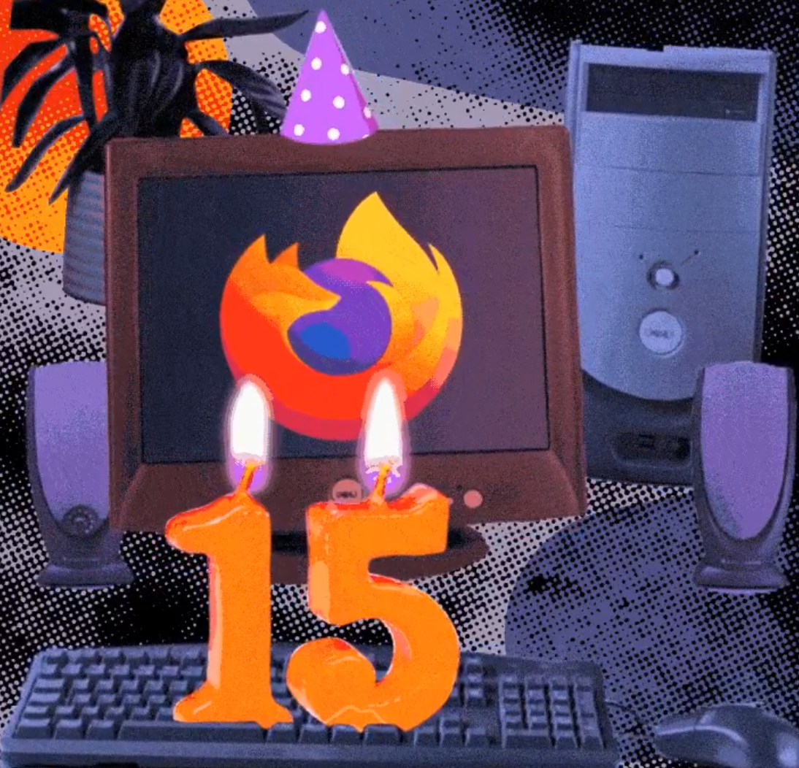

Top Tweets/Celebrations-

<blockquote class="twitter-tweet" data-lang="en">
The only glow up that matters. 🎂 <a href="https://t.co/19e4AXkXfS">pic.twitter.com/19e4AXkXfS</a>
&mdash; Firefox 🔥 (@firefox) <a href="https://twitter.com/firefox/status/1193121052609658881?ref_src=twsrc%5Etfw">November 9, 2019</a></blockquote>

<blockquote class="twitter-tweet" data-lang="en">
Firefox at 15: its rise, fall, and privacy-first renaissance <a href="https://t.co/EwoDJUSgtO">https://t.co/EwoDJUSgtO</a>
&mdash; Fast Company (@FastCompany) <a href="https://twitter.com/FastCompany/status/1192767884617011200?ref_src=twsrc%5Etfw">November 8, 2019</a></blockquote>

<blockquote class="twitter-tweet" data-lang="en">
A lot has changed in the last 15 years.  What hasn&#39;t is our commitment to creating an open, diverse and secure internet. <a href="https://t.co/OMfzKZ509W">https://t.co/OMfzKZ509W</a>
&mdash; Firefox 🔥 (@firefox) <a href="https://twitter.com/firefox/status/1192826787346161671?ref_src=twsrc%5Etfw">November 8, 2019</a></blockquote>

<blockquote class="twitter-tweet" data-lang="en">
<a href="https://twitter.com/hashtag/OnThisDay?src=hash&amp;ref_src=twsrc%5Etfw">#OnThisDay</a>, 9/11/2004, The <a href="https://twitter.com/mozilla?ref_src=twsrc%5Etfw">@mozilla</a>&#39;s next generation web browser, named <a href="https://twitter.com/firefox?ref_src=twsrc%5Etfw">@firefox</a>, has been introduced <a href="https://t.co/jeBcuCiIPt">pic.twitter.com/jeBcuCiIPt</a>
&mdash; Sunnyvale S.r.l. (@sunnyvale_it) <a href="https://twitter.com/sunnyvale_it/status/1193075840860467206?ref_src=twsrc%5Etfw">November 9, 2019</a></blockquote>

<blockquote class="twitter-tweet" data-lang="en">
🎊 Happy 15h birthday <a href="https://twitter.com/firefox?ref_src=twsrc%5Etfw">@firefox</a> 🎊  Firefox 1.0 was released on November 9th, 2004. The scrappy alternative to Internet Explorer 6 (☠️) had revolutionary features such as tabbed browsing (!), popup blocking, themes, and extensions. 🔥  It changed the world. Really, it did 👏👏 <a href="https://t.co/LekBwUtF9T">pic.twitter.com/LekBwUtF9T</a>
&mdash; Changelog (@changelog) <a href="https://twitter.com/changelog/status/1193155535387926534?ref_src=twsrc%5Etfw">November 9, 2019</a></blockquote>

<blockquote class="twitter-tweet" data-lang="en">
On this day in 2004: Firefox 1.0 released <a href="https://t.co/Xzx8L8mXBg">pic.twitter.com/Xzx8L8mXBg</a>
&mdash; The Worldwide Gist (@worldwidegist) <a href="https://twitter.com/worldwidegist/status/1193151949878771712?ref_src=twsrc%5Etfw">November 9, 2019</a></blockquote>

If you are not a Firefox user yet, it's time to **Go Firefox**!

## [Download latest Firefox Browser.](https://www.mozilla.org/en-US/firefox/)

I hope you have a very safe and secure browsing experience!
